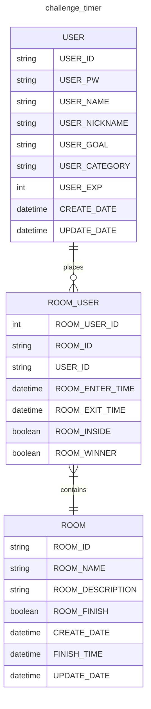

## 1. 개요

개인 공부를 하던 와중에 친구와 공부내기에서 떠올린 프로젝트이다.

친구와 몇시간 혹은 특정 장소에서 공부한걸 인증한걸 공유하자 (도서관, 카페) 대신 집과 거리가 멀고, 공부를 하지 않고 인증만해도 그정도의 정성은 인정하자는 분위기였다.

근데 매번 타이머키고 인증하고, 또 공부 타이머앱 깔고 분석하기엔 뭔가 별루였다… (뭔가 보상이 없달까?)

그래서 뭔가 보상도 있고, 인터페이스도 쉬우면서, 동기부여가 되는 타이머앱을 만들기로 했다.

## 2. 기능

- 기본기능
  - 타이머 : 당연하다, 타이머 앱이니까 타이머는 기본 탑재이다
  - 분석기능 : 기본적인 목표치를 설정 주단위 분석 또는 달단위 분석 기능을 탑재할까 싶다
  - 공유기능 : 자신의 공부시간 혹은 공부량등을 자랑할수있게 공유기능을 넣을예정
  - 커뮤니티 기능 : 사실 넣을까 말까 했지만 가장 중요하지 않을까 싶다. 혼자 공부하기보다 누군가의 도움 혹은 머리식힐겸의 커뮤니티 기능이 있으면 좋지 않을까? (카테고리별 커뮤니티)
- 심화기능
  - 챌린지 : 상대방과 겨루기 기능으로 동기부여가 되지 않을까? (win - lose)
  - 보상기능 : 아직 생각중이긴하나 캐릭터같은것을 성장시키는 느낌처럼 만들면 좋을거 같다 (게임?)
  - 채팅 : 개인적으로 넣는다기보다 챌린지하는 상대와 대화기능이 있었으면 좋겠다는 느낌에 넣은거지만 만들다보면 채팅이 기본기능으로 탑재될 가능성도 있다.

## 3. 구현사항

- [ x ] 로그인
- [ x ] 회원가입
- [ ] Timer_Room 기능
  - [ ] Share_room
  - [ ] Single_room
- [ ] 타이머 관련기능
- [ ] 차트 및 측정 기능
  - [ ] 분석기능
- [ ] 커뮤니티 기능
  - [ ] 카테고리별 커뮤니티
- [ ] 타이머 종료 이후 winner, loser 기능
  - [ ] 보상 기능
- [ ] 채팅 기능

## 4. 적용 기술

1. React (CRA)
2. TailWindCSS
3. Recoil
4. Firebase
5. Jest/React-testing-library

Nextjs로 구현할려다 현재 appDir emotion관련된 부분때문에 react로 먼저 구현이후 nextjs로 포팅할 예정이다.

현재 빠르게 구현을 위해 Firebase를 사용하지만, 추후 nestjs로 백엔드 개발과 DB도 만들어볼 예정이다.

무엇보다 이번 프로젝트는 유명한 tailwindCSS와 테스트코드도 작성될 예정

## 5. ERD

## 6. 플로우 차트
