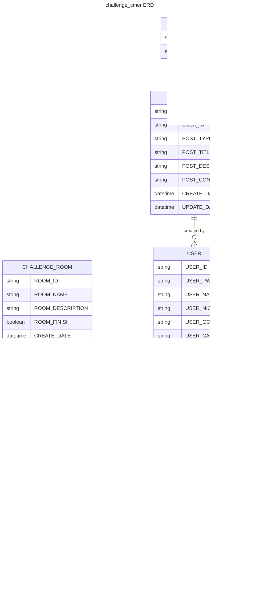

## 1. 개요

개인 공부를 하던 와중에 친구와 공부내기에서 떠올린 프로젝트이다.

친구와 몇시간 혹은 특정 장소에서 공부한걸 인증한걸 공유하자 (도서관, 카페) 대신 집과 거리가 멀고, 공부를 하지 않고 인증만해도 그정도의 정성은 인정하자는 분위기였다.

근데 매번 타이머키고 인증하고, 또 공부 타이머앱 깔고 분석하기엔 뭔가 별루였다… (뭔가 보상이 없달까?)

그래서 뭔가 보상도 있고, 인터페이스도 쉬우면서, 동기부여가 되는 타이머앱을 만들기로 했다.

## 2. 기능

- 기본기능
  - 타이머 : 당연하다, 타이머 앱이니까 타이머는 기본 탑재이다
  - 분석기능 : 기본적인 목표치를 설정 주단위 분석 또는 달단위 분석 기능을 탑재할까 싶다
  - 공유기능 : 자신의 공부시간 혹은 공부량등을 자랑할수있게 공유기능을 넣을예정
  - 커뮤니티 기능 : 사실 넣을까 말까 했지만 가장 중요하지 않을까 싶다. 혼자 공부하기보다 누군가의 도움 혹은 머리식힐겸의 커뮤니티 기능이 있으면 좋지 않을까? (카테고리별 커뮤니티)
- 심화기능
  - 챌린지 : 상대방과 겨루기 기능으로 동기부여가 되지 않을까? (win - lose)
  - 보상기능 : 아직 생각중이긴하나 캐릭터같은것을 성장시키는 느낌처럼 만들면 좋을거 같다 (게임?)
  - 채팅 : 개인적으로 넣는다기보다 챌린지하는 상대와 대화기능이 있었으면 좋겠다는 느낌에 넣은거지만 만들다보면 채팅이 기본기능으로 탑재될 가능성도 있다.

## 3. 구현사항

우선순위

- [x] 로그인
- [x] 회원가입
- [ ] Room 기능
  - [ ] Share_room (공유방) → challange
    - [ ] 타이머
  - [ ] Single_room
    - [x] 타이머
      - [x] 회원로직
      - [x] 비회원로직
    - [ ] 스탑워치(기록x)
- [x] 타이머 관련기능
- [ ] 마이페이지
  - [ ] 프로필 변경
  - [ ] 타이머 기록
  - [ ] 차트 및 측정 기능
    - [ ] 분석기능

---

후순위

- [ ] 커뮤니티 기능
  - [ ] 카테고리별 커뮤니티
- [ ] 타이머 종료 이후 winner, loser 기능
  - [ ] 보상 기능
- [ ] 채팅 기능

## 4. 적용 기술

1. React (CRA) → vite
2. tailwindCSS
   1. https://daisyui.com/ → 빠른 mvp 를 위한 작업
3. ~~Recoil~~
   1. zustand
4. Firebase
5. Jest/React-testing-library
6. https://github.com/gpbl/react-day-picker
   1. https://github.com/wojtekmaj/react-calendar에 비해 업데이트 등의 장점이 있다고 생각

Nextjs로 구현할려다 현재 appDir emotion관련된 부분때문에 react로 먼저 구현이후 nextjs로 포팅할 예정이다.

현재 빠르게 구현을 위해 Firebase를 사용하지만, 추후 nestjs로 백엔드 개발과 DB도 만들어볼 예정이다.

무엇보다 이번 프로젝트는 유명한 tailwindCSS와 테스트코드도 작성될 예정

## 5. ERD



## 6. 플로우 차트

## 7. 시퀀스 다이어그램


## 8. 정책 정리

### 타이머/스탑워치

1. 타이머
   1. 회원
      1. 타이머의 경우 설정된 시간에서 80% 이상할시에 기록으로 인정
      2. 그외 기록의 경우 로그에서 확인은 가능하지만 최종 기록으로는 인정하지 않음
      3. 분석기능을 통해 자신의 기록을 확인 가능
   2. 비회원
      1. 비회원의 경우 로컬스토리지에 저장된 데이터만 가져온다
      2. 분석 기능은 사용할수 없다.
2. 스탑워치

   1. 스탑워치의 경우 기록으로 인정 x (정확한 캐치가 불가능함)
   2. 스탑워치 정지시간은 기록되지 않는다 (측정당시에만 유효한 데이터)

3. 상대방과의 경쟁 (타이머)
   1. 상대방과의 연결된 기준으로 설정되며, 기준시간의 경우 방장이 설정한 시간 기준으로 기록된다
      1. 기준시간보다 낮은 시간에 나간경우 타이머 기준에 따라 80% 이상일때만 기록
         1. 비회원의 경우 따로 기록하지 않는다
         2. 회원의 경우 DB에 로그기록
      2. 기준시간내에 사용자가 최소화, 닫기 등의 행동을 할경우
         1. 5분의 유효시간을 두고, 사용자가 재입장을 하지 않을경우 자동적으로 상대방 승리로 처리
         2. 5분이내로 입장할경우
            1. 패널티로 상대방보다 낮은 점수로 기록됨 (-5)
4. 점수기준
   1. 점수기준은 기준시간을 %(퍼센티지)로 측정했을시 기준으로 처리하며,
      기준시간을 모두 채울시 100점, 그외 시간에 나갈시 관련 % 점수로 처리된다
      ex) 80% → 80점, 100% → 100점, 79% → 점수 없음
   2. 단, 80% 미만일 경우 측정 및 기록을 하지 않으며, 점수또한 측정되지 않는다.
      1. 패널티로 80% 미만으로 측정된 경우도 포함된다
   3. 경쟁 승자 점수
      1. 승자의 경우 기준점수 (최소:80, 최대:100) + 20점을 추가로 받는다
      2. 패자의 경우 80% 이상일 경우 관련 점수에 따라 분배되며 추가 점수는 없다
      3. 동률일 경우 모두 기준점수에 따라 분배되며 + 5점을 추가로 받는다.

```

```
